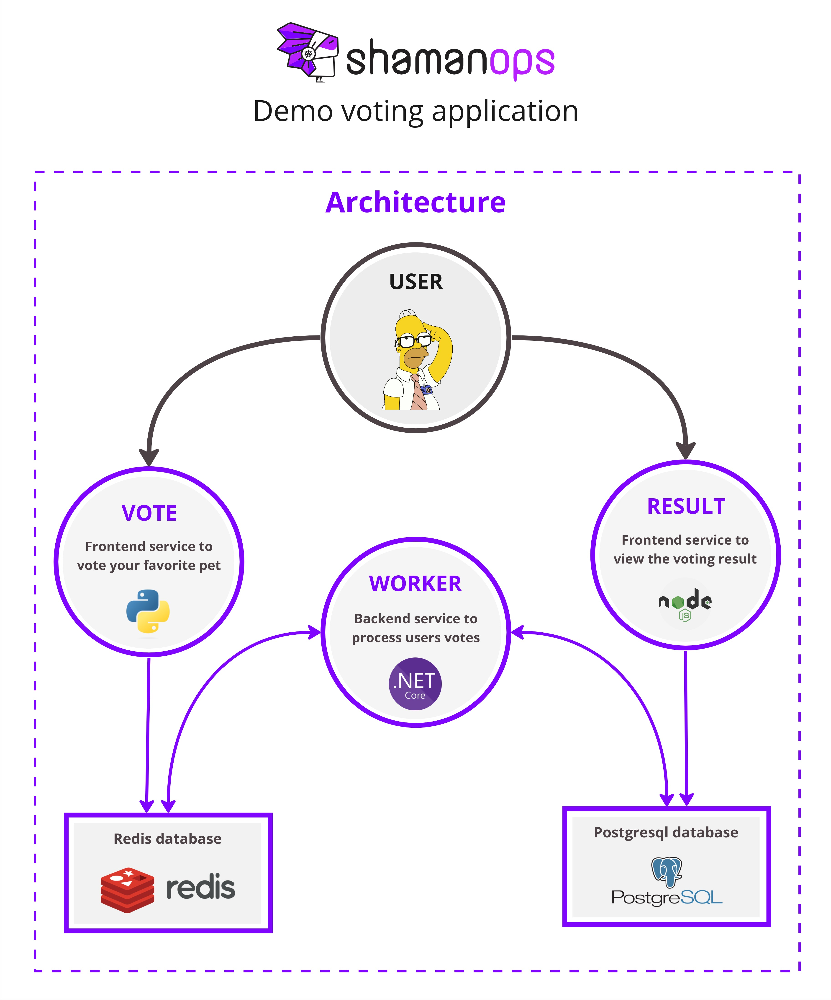

# ShamanOps - Demo voting application

This is an application for demo purposes.

## Arquitecture


## Pre-requisites
Here a list of pre requisites to make available redis server and postgresql server in your kubernetes cluster.
For this tutorial, you need to have installed this CLI Tools:
- argocd (https://argo-cd.readthedocs.io/en/stable/cli_installation/#download-latest-version)
- helm (https://helm.sh/docs/intro/install/#from-script)

### Add Bitnami repository to HELM
```bash
helm repo add bitnami https://charts.bitnami.com/bitnami
```

### Login to ArgoCD
```bash
argocd login --username admin --grpc-web --insecure argocd.{your-fully-qualified-domain-name}
```
> [!NOTE]
> Replace {your-fully-qualified-domain-name} with your Fully Qualified Domain Name - FQDN (ex: apps.customer.com)

### Create examples project in ArgoCD
```bash
argocd proj create hipercompumegared-prod --upsert \
	-d https://kubernetes.default.svc,hipercompumegared-prod \
	-s '*' --allow-cluster-resource Namespace \
	--grpc-web
```

### Deploy ephemereal Redis server
```bash
argocd app create redis-prod --project hipercompumegared-prod \
	--repo https://charts.bitnami.com/bitnami \
	--helm-chart redis --revision 18.6.2 \
	--dest-namespace hipercompumegared-prod \
	--dest-server https://kubernetes.default.svc \
	--helm-set auth.enabled=false \
	--helm-set architecture=standalone \
	--helm-set master.persistence.enabled=false \
	--helm-set replica.persistence.enabled=false \
	--sync-option CreateNamespace=true \
	--grpc-web
argocd app sync redis-prod --project hipercompumegared-prod --grpc-web
```

### Deploy ephemereal PostgreSQL server
```bash
argocd app create postgresql-prod --project hipercompumegared-prod \
	--repo https://charts.bitnami.com/bitnami \
	--helm-chart postgresql --revision 13.2.27 \
	--dest-namespace hipercompumegared-prod \
	--dest-server https://kubernetes.default.svc \
	--helm-set architecture=standalone \
	--helm-set primary.persistence.enabled=false \
	--helm-set global.postgresql.auth.username=postgresql \
	--helm-set global.postgresql.auth.password=postgresql \
	--helm-set global.postgresql.auth.database=postgresql \
	--sync-option CreateNamespace=true \
	--grpc-web
argocd app sync postgresql-prod --project hipercompumegared-prod --grpc-web
```

## Fork this repositories
- Vote app: https://github.com/HiperCompuMegaRed/vote.git
- Result app: https://github.com/HiperCompuMegaRed/result.git
- Worker app: https://github.com/HiperCompuMegaRed/worker.git

## Use ShamanOps

Enhance your deployment using ShamanOps! 
1) Check our documentation at: (https://docs.shamanops.com/category/start-your-pipeline)
2) Choose your CI platform
3) Bring the YAML file and enjoy! ✨

> [!NOTE]
> This tutorial uses as project name: "hipercompumegared". You must set up name by config the YAML file with the parameter **project: 'hipercompumegared'**<br><br>
> This tutorial is intended for a single productive environment. You can set up the deployment only in production by config the YAML file with the parameter **environments: 'minimal'**

## License
in discussion
